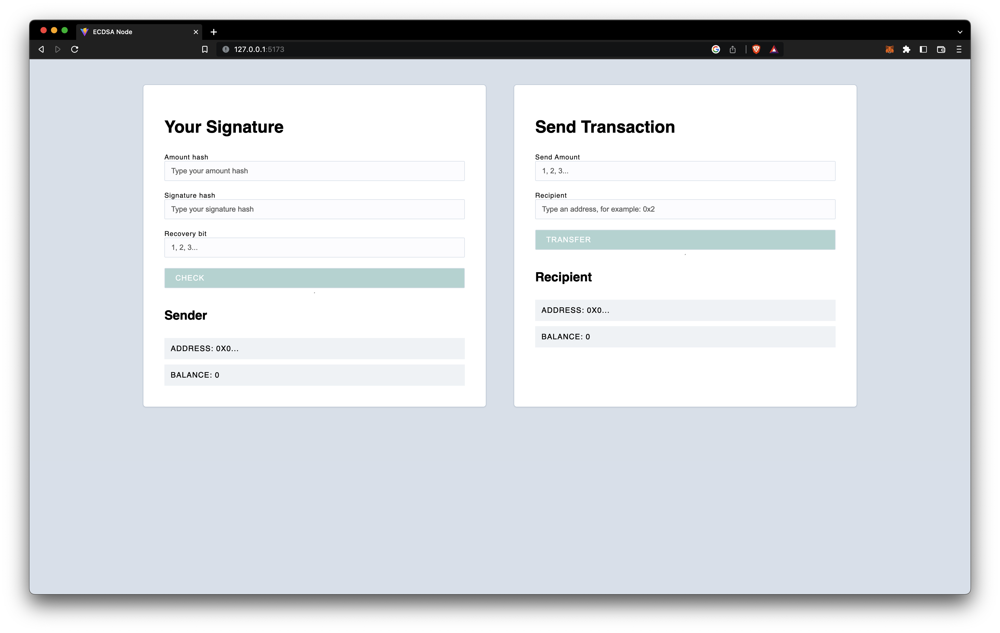
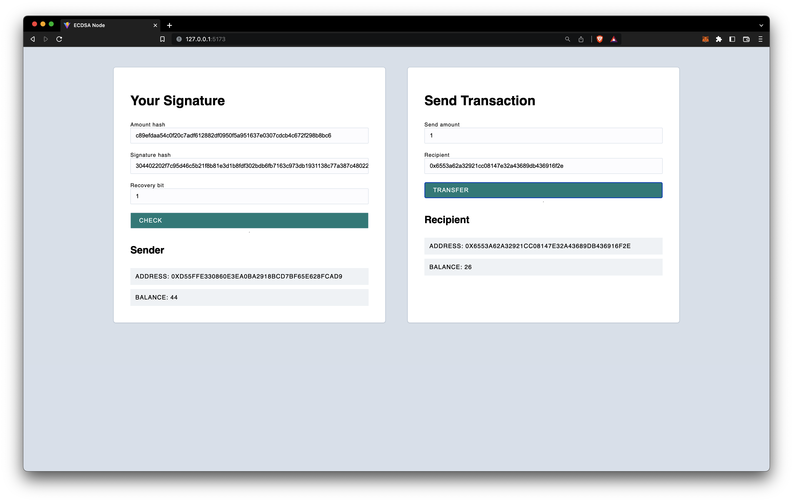

## ECDSA Node - Eduardo Aire

Forked from [Alchemy University](https://github.com/alchemyplatform/ecdsa-node)

> This project is an example of using a client and server to facilitate transfers between different addresses. Since there is just a single server on the back-end handling transfers, this is clearly very centralized. We won't worry about distributed consensus for this project.
>
> However, something that we would like to incoporate is Public Key Cryptography. By using Elliptic Curve Digital Signatures we can make it so the server only allows transfers that have been signed for by the person who owns the associated address.

## Summary

For this exercise, I decided to use a signature to validate the sender account and the value to transfer, to achieve this the sender needs to create a signature, fill the form with the amount hash, the signature hash, and the recovery bit, then fill the transfer form and if the amount is valid the transaction is completed.

## How it works:

### Private key

You can use some of the addresses set in the [server file](./server/index.js) in the `const balances` variable, or you can create new addresses with [generate.js](./server/scripts/generate.js)

```SHELL
server $ node scripts/generate
Private key: add8252d633ad0a4da8d1ca7c19a3bc0d87c02a815d7423b6b6635065dd1a122
Public key:  0485c872f84f1938602a9385f8d4822b0e3759c87d7433ff52466910d0d3bac1bcb8240562ca3efd4ba244380d764ff0df0d6fb043809f21a9cc8bda493ad292ea
Address:     0x64c6f4a934cd73819050aef200f1a4b1d6c00117
```

### Create a signature

You can create a signature using the [sign.js](./server/scripts/sign.js) script, just write `node scripts/sign` in a terminal on your server and follow the prompts:

```SHELL
server $ node scripts/sign
What is your Private Key? ea9b79245c9cb31962b56cbeebfc4a1d1a527e0acafd90ae87576823bc570804
Private Key:  ea9b79245c9cb31962b56cbeebfc4a1d1a527e0acafd90ae87576823bc570804
Type the amount of your transfer: 1
Amount hash:  c89efdaa54c0f20c7adf612882df0950f5a951637e0307cdcb4c672f298b8bc6
Signature hash:  304402202f7c95d46c5b21f8b81e3d1b8fdf302bdb6fb7163c973db1931138c77a387c480220013e0365acd5f8ff8ed3abf6fa32500f736465e9e80dce7a74d314d002bab6ee
Recovery bit:  1
Public Key:  045cba6a864603c5b0f2f8d25a19c6b191718259c9288e7a29f7a663746ab8247c4675eb0badeafeb8ac8cbb9581e40145610bf55e0109fbf731525d72e69bb11e
Address:  0xd55ffe330860e3ea0ba2918bcd7bf65e628fcad9
```

### Run the Server and the Client

For this, you can `npm run dev` both the client and the server or run `npm run dev` at the parent level, and a concurrent terminal will run both processes (don't forget to `npm install` the dependencies before).



## Test it!

-   Fill in the data of your signature in the first form:

    -   **Amount hash:** `c89efdaa54c0f20c7adf612882df0950f5a951637e0307cdcb4c672f298b8bc6`

    -   **Signature hash:** `304402202f7c95d46c5b21f8b81e3d1b8fdf302bdb6fb7163c973db1931138c77a387c480220013e0365acd5f8ff8ed3abf6fa32500f736465e9e80dce7a74d314d002bab6ee`

    -   **Recovery bit:** `1`

-   If the values are correct your address and balance should appear
-   Now fill out the send transaction form
    -   **Send amount:** Same amount you used to create your signature
    -   **Recipient:** A recipient address[^1]
-   If everything goes well you'll see the recipient's address and balance



[^1]: You can send money to any address, if the address doesn't exist you'll send the money anyway and a new entry will be created
